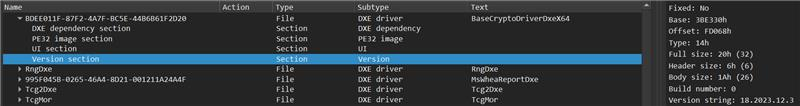

# Shared Crypto Binaries

Shared crypto consists of a set of pre-built binaries that provide cryptographic services. The services are exposed
to other modules via dynamic interfaces such as PPIs in the PEI phase and protocols in the DXE and MM phases

**This project does not directly implement crypto algorithms**. Crypto algorithm implementation is provided by an
underlying crypto provider. The provided may change over time based on industry shifts in crypto requirements,
enhancements for embedded crypto support in available crypto projects, and overall crypto provider quality and
maintainership.

- Currently, the OpenSSL crypto project is used.

Any consumer of this binary should expect that the underlying crypto provider may change. Consumers are encouraged to
participate in all aspects of shared crypto including code contributions and feedback.

## Terminology

- **Crypto Provider** - The project that provides an implementation of cryptographic algorithms used by this project
  to provide those crypto services to platform firmware.
  - Examples: [OpenSSL](https://github.com/openssl/openssl), [Mbed TLS](https://github.com/Mbed-TLS/mbedtls),
    [SymCrypt](https://github.com/microsoft/SymCrypt).
- **Flavor** - A collection of cryptographic algorithms included in a given shared crypto binary.
- **Module Type** - The module type per the definition in the [EDK II Build Specification](https://tianocore-docs.github.io/edk2-BuildSpecification/draft/appendix_h_module_types.html#appendix-h-module-types).
  A module type defines the applicable environment for code during boot. Module types are constrained to certain boot
  phases when the code may be dispatched and loaded.
  - Examples: `PEIM`, `DXE_DRIVER`, `DXE_SMM_DRIVER`, etc.
- **Phase** - The "boot phase" that the binary applies to where a phase is defined in the [Platform Initialization
  Specification](https://uefi.org/specs/PI/1.8A/).
- **Platform Firmware** - A firmware project that integrates the shared crypto binaries made available by this project.
  The shared crypto binaries install dynamic interfaces (e.g. the Crypto protocol in DXE) that make the crypto services
  available to any module that locates the dynamic interface and calls the crypto functions. To assist with locating
  the crypto interfaces, the `CryptoDriver.inc.dsc` file provided by this project specifies a `BaseCryptLib` instance
  that back each function in the library with the code to locate the dynamic interface and call the corresponding
  function.

  This means platforms that were previously linking different instances of `BaseCryptLib` that actually linked crypto
  code can simply use the `CryptoDriver.inc.dsc` file to use shared crypto without changing any code that calls into
  the `BaseCryptLib` interface. *Shared Crypto* means the crypto code in the binary from this project is shared across
  all other modules.

  An open-source example of platform firmware is the [Mu Tiano Platforms firmware repo](https://github.com/microsoft/mu_tiano_platforms).
- **Shared Crypto** - The name of this project. Shared crypto means a set of pre-built binaries that provide
  cryptographic services.

## Benefits

- Smaller binary sizes
- Easier to service/upgrade
- Reduced platform firmware build times
- Central tracking of binary versioning and version details
- Ability to more rigorously track crypto such as with SBOM

There are different flavors of shared crypto binaries available, with different functions supported. For example, if
HMAC is not required in the PEI phase of your project, you can simply select the flavor without HMAC support.

## Adoption/Migration Considerations

Transitioning to using these binaries for platforms that previously relied on BaseCryptLib have a few decisions during
the process.

1. **Your Platform** Crypto Requirements

   You need to select what flavor of crypto works for your platform for each phase. Cross reference the PCD flavor
   files and your platform's requirements to find which one works best. The `ALL` flavor enables all supported
   cryptographic functions.

   If you require a crypto algorithm not available in any flavor, including `ALL`, file a feature request issue in
   this repo describing the algorithm required and a use case for that algorithm in platform firmware.

2. **Your Platform** Architecture

    For each phase, ensure you have selected the correct architecture. Failure to do so will potentially result in
    build errors and incorrect behaior during boot.

3. Dependencies Built into Shared Crypto

    Ultimately, the shared crypto binaries have dependencies that must be fulfilled by the shared crypto project
    when the binaries are built. It is important to be aware of those selections and how they may impact usage of
    the binary.

    **Feedback** on dependency selections is welcome.

    There are a couple of specific services (library selections) that you need to be aware of when it comes to crypto
    interaction.

    - **Debug Output** - The binary for each boot phase is linked against a `DebugLib` instance.
      - Currently the `Null` instance of `DebugLib` is used for most phases which means that those binaries do not emit
        debug output.
      - The `PEIM` binaries are currently linked against the [`PeiDxeDebugLibReportStatusCode`](https://github.com/microsoft/mu_basecore/tree/HEAD/MdeModulePkg/Library/PeiDxeDebugLibReportStatusCode)
      library instance which sends debug output to the report status code infrastructure.

      - The `DXE_DRIVER` binaries are currently linked against the [`UefiDebugLibDebugPortProtocol`](https://github.com/microsoft/mu_basecore/tree/HEAD/MdePkg/Library/UefiDebugLibDebugPortProtocol)
      library instance which sends messages to an instance of the
      [`EFI_DEBUGPORT_PROTOCOL`](https://github.com/microsoft/mu_basecore/blob/HEAD/MdePkg/Include/Protocol/DebugPort.h).

      - Always check `CryptoBinPkg.dsc` to verify the `DebugLib` instance linked against the crypto module type you
        depend on to verify the instance actively used.

    - **Random Number Generation (RNG)** - Crypto operations can depend on random number generation. Therefore, the
      crypto code compiled into the shared crypto binary must be linked against a method to generate random numbers.

      Currently, the following selections are made per shared crypto binary type:

      - `CryptoPei` - `PeiRngLib` which uses the Crypto PPI to provide random numbers. This means a platform module
        must produce the PPI (`gEfiRngPpiGuid`).
      - `CryptoDxe` - `DxeRngLib` which uses the Crypto protocol to provide random numbers. This means a platform
        module must produce the protocol (`gEfiRngProtocolGuid`).
      - `CryptoRuntimeDxe` - `DxeRngLib` which uses the Crypto protocol to provide randmon numbers. This means a
        platform module must produce the protocol (`gEfiRngProtocolGuid`).
      - `CryptoStandaloneMm (AARCH64)` - `BaseRngLibTimerLib` is linked to the crypto binary.
      - `CryptoStandaloneMm (X64)` - `BaseRngLib` is linked to the binary which will use the rndr instruction.
      - `CryptoMmSupervisorStandaloneMm (X64)` - `BaseRngLib` is linked to the binary which will use the rndr instruction.
      - `CryptoSmm` - `BaseRngLib` is linked to the binary which will use the rndr instruction.

      Look for the `RngLib` instance in `CryptoBinPkg.dsc` to see the current random generation library being used.

    - **PE/COFF Binary Properties** - Each crypto binary within shared crypto is a PE32 binary with a .efi extension.
      To allow image loaders to apply page attributes to a loaded image, section alignment is set to 4KB. In some cases,
      file alignment is set to 4k as well. This is currently the case for `PEIM` binaries to support 4k section
      alignment in Execute-in-Place (XIP) environments.

### Integrating the Pre-compiled binaries

1. Include an external dependency file for the shared crypto binary release. An example is shown below.

   ```json
   {
     "scope": "global",
     "type": "nuget",
     "name": "edk2-basecrypto-driver-bin",
     "source": "https://pkgs.dev.azure.com/projectmu/mu/_packaging/Mu-Public/nuget/v3/index.json",
     "version": "2023.2.9",
     "flags": ["set_build_var"],
     "var_name": "BLD_*_SHARED_CRYPTO_PATH"
   }
   ```

   - **IMPORTANT**: The `var_name` should be as specified above so the files distributed with the binaries that use that
   variable value to resolve the file paths to the binaries can resolve properly.

   - **Purpose**: An external dependency is used within the [Stuart build system](https://www.tianocore.org/edk2-pytool-extensions/using/install/)
     to automatically pull down a binary into a local workspace. In this case, the versioned binary on a NuGet feed is
     being retrieved. Replace the version with the applicable version (usually latest available) when you follow these
     instructions. You can of course use other methods to retrieve the release from the NuGet feed source shown if your
     project does not use Stuart.

2. Define the service level that you want for each phase of UEFI in the defines section of your DSC.

    ```ini
    [Defines]
        DEFINE PEI_CRYPTO_SERVICES                  = TINY_SHA
        DEFINE DXE_CRYPTO_SERVICES                  = STANDARD
        DEFINE RUNTIMEDXE_CRYPTO_SERVICES           = NONE
        DEFINE SMM_CRYPTO_SERVICES                  = STANDARD
        DEFINE STANDALONEMM_CRYPTO_SERVICES         = NONE
        DEFINE STANDALONEMM_MMSUPV_CRYPTO_SERVICES  = NONE
        DEFINE PEI_CRYPTO_ARCH                      = IA32
        DEFINE DXE_CRYPTO_ARCH                      = X64
        DEFINE RUNTIMEDXE_CRYPTO_ARCH               = NONE
        DEFINE SMM_CRYPTO_ARCH                      = X64
        DEFINE STANDALONEMM_CRYPTO_ARCH             = NONE
        DEFINE STANDALONEMM_MMSUPV_CRYPTO_ARCH      = NONE
    ```

    The above example is for a standard Intel platform and the service levels or flavors available.

    This example shows all of the `DEFINE` options available with common values selected for those options. **ThiS
    example cannot be copied as-is. You must evaluate the crypto services and architecture for your platform and
    replace the values above with the proper selection.**

    `<PHASE>_CRYPTO_SERVICES` lines set to `NONE` do not need to be specified. Any `<PHASE>_CRYPTO_SERVICES` line set
    to a non-`NONE` value must set the corresponding `<PHASE>_CRYPTO_ARCH` value to a non-`NONE` value as well.

    Two options are provided for Standalone MM. It is important to select the option based on the Standalone MM core
    used on your platform:

    - [`StandaloneMmPkg`](https://github.com/tianocore/edk2/tree/master/StandaloneMmPkg/Core) - Use `STANDALONEMM_CRYPTO_SERVICES`
    - [`MmSupervisorPkg`](https://github.com/microsoft/mu_feature_mm_supv/tree/main/MmSupervisorPkg/Core) - Use `STANDALONEMM_MMSUPV_CRYPTO_SERVICES`

    Since the MM Supervisor currently does not support `AARCH64`, only a `X64` MM Supervisor Standalone MM binary is
    available. A platform should not have both `STANDALONEMM_CRYPTO_SERVICES` and `STANDALONEMM_MMSUPV_CRYPTO_SERVICES`
    set to non-`NONE` values.

3. Add the DSC include

    ```ini
    !include $(SHARED_CRYPTO_PATH)/Driver/Bin/CryptoDriver.inc.dsc
    ```

    This sets the definitions for BaseCryptLib as well as includes the correct flavor level of the component you
    wish to use.

    > **Note:** This example depends on the `Stuart` tool in `Step 1` setting the `SHARED_CRYPTO_PATH` environment
    > variable. If you are not using `Stuart` then this example will not work and you will need to provide the path
    > to the file in your workspace.

4. Add the FDF includes to your platform FDF

    Currently, it isn't possible in an FDF to redefine a FV section and have them be combined. This means you will
    need to place the `!include` line within the proper FV section or a build error will result.

    A `!include` line only needs to be included for each boot phase you are actually using. This means that phase must
    have a `<PHASE>_CRYPTO_SERVICES` `DEFINE` line in the `[Defines]` section set to a non-`NULL`. If this is not the
    case, a build error will result.

    **Example** - In this example a platform firmware has two firmware volumes. One is called `FVBOOTBLOCK` and
    contains early `SEC` and `PEI` code. Therefore, `CryptoDriver.PEI.inc.fdf` is placed in that FV section. The
    second firmware volume is called `FVDXE` and it contains the remainder of the platform's firmware code. Therefore,
    all other `!include` lines are placed in that FV section.

    > **Note:** This example shows all possible options. In practice, a platform may use some or none of these options.
    > In particular, `SMM` and `STANDALONEMM` would never be included in the same platform as they're conflicting
    > environments for `MM`.

    ```ini
    [FV.FVBOOTBLOCK]
      ...
    !include $(SHARED_CRYPTO_PATH)/Driver/Bin/CryptoDriver.PEI.inc.fdf
    ...

    ```ini
    [FV.FVDXE]
      ...
      !include $(SHARED_CRYPTO_PATH)/Driver/Bin/CryptoDriver.DXE.inc.fdf
      !include $(SHARED_CRYPTO_PATH)/Driver/Bin/CryptoDriver.RUNTIMEDXE.inc.fdf
      !include $(SHARED_CRYPTO_PATH)/Driver/Bin/CryptoDriver.SMM.inc.fdf
      !include $(SHARED_CRYPTO_PATH)/Driver/Bin/CryptoDriver.STANDALONEMM.inc.fdf
    ```

    Finally, the FDF file needs rules to understand how to compose a FFS file from the .efi files distributed in
    Shared Crypto. An example of how to do this is provided in [`CryptoBinPkg/Driver/Bin/CryptoDriver.BuildRules.inc.fdf`](https://github.com/microsoft/mu_crypto_release/blob/HEAD/CryptoBinPkg/Driver/Bin/CryptoDriver.BuildRules.inc.fdf).
    You can include that file directly following the instructions in the file header or simply use it as a reference
    to add the individual rules applicable to your platform to your platform FDF file.

## Common Build/Configuration Errors

1. Typos - Verify all macro and values match the expected names.
2. Older Shared Crypto - It is fine to use an older shared crypto release. However, you must ensure the instructions
   you are following and dependencies like the `CryptoPkg` code you are using match what was used at the time of that
   release. `CryptoPkg` is in the Project Mu [Mu Basecore](https://github.com/microsoft/mu_basecore) repository.
3. Mismatched Defines and Includes - Crypto services for a phase must be opted into by using the corresponding
   `<PHASE>_CRYPTO_SERVICES` line. Presence of that line then requires a `<PHASE>_CRYPTO_ARCH` that specifies the
   architecture to use for that boot phase. For each `<PHASE>_CRYPTO_SERVICES` line present the corresponding
   `!include CryptoDriver.<PHASE>.inc.fdf` line may be used.
4. Incorrect DSC Include - The correct DSC include to use in the platform DSC is
   `!include $(SHARED_CRYPTO_PATH)/Driver/Bin/CryptoDriver.inc.dsc`. That line should be included at the top of the
   DSC before the `[LibraryClasses]` and `[Components]` and after the `[Defines]` section. This allows the file to
   impact the platform build but it also allows the platform DSC to override any content from the file if necessary.
5. Conflicting Platform Content in the DSC - The `CryptoDriver.inc.dsc` file will set the `BaseCryptLib` and `TlsLib`
   instances for each boot phase opted into in the `[Defines]` section. Platforms should remove any instances of those
   library classes in the platform DSC to ensure the expected instance from the include are used.
6. Incorrect Placement of the FDF Include Lines - The `!include CryptoDriver.<PHASE>.inc.fdf` lines must be placed in
   an FV section. They **cannot** be placed before an apriori section; that will result in a build error. They
   **cannot** be placed within an apriori section; that will not result in a build error but incorrect operation during
   boot. Consider dispatch order when placing the files in the FDF. Ideally, they should be placed before modules
   that use the `EDKII_CRYPTO_PPI` (PEI) or `EDKII_CRYPTO_PROTOCOL` (DXE/MM). This will allow those module's
   dependency expressions on the interfaces to be satisfied more quickly during dispatch.
7. Incorrect Architecture - Verify the correct architecture is used in the `<PHASE>_CRYPTO_ARCH` lines.
8. Incompatible `CryptoPkg` Version in the Platform Submodule - The shared crypto binaries produce an instance of the
   EDK II Crypto PPIs and Protocols. The interface of the PPI and Protocol may change over the time. In the past, the
   interface was not always updated in a backward compatible manner. Therefore, verify that interface used in the
   shared crypto build matches the version in the `CryptoPkg` used in your project. The version is tracked in
   [`CryptoPkg/Include/Protocol/Crypto.h`](https://github.com/microsoft/mu_basecore/blob/HEAD/CryptoPkg/Include/Protocol/Crypto.h).
   The version should match in the `MU_BASECORE` submodule of the `mu_crypto_release` repository and the version in
   your repo. If it does not, you may need to use a different shared crypto release.

## Finding the Version of a Shared Crypto Binary

Version information is placed into the `VERSION_STRING` of the .inf files that are made available in Shared Crypto
releases. For example, this is the `[DEFINES]` section for a `Driver/Bin/CryptoDriverBin_STANDARD_Dxe_DEBUG_X64.inf`
file.

```
[Defines]
  INF_VERSION                    = 0x0001001B
  BASE_NAME                      = BaseCryptoDriverDxeX64
  MODULE_UNI_FILE                = Crypto.uni
  FILE_GUID                      = bdee011f-87f2-4a7f-bc5e-44b6b61f2D20
  MODULE_TYPE                    = DXE_DRIVER
  VERSION_STRING                 = 18.2023.12.3
  PI_SPECIFICATION_VERSION       = 0x00010032
  ENTRY_POINT                    = CryptoDxeEntry
```

When Shared Crypto is used by platform, this informs the build system that the `VERSION_STRING` value should be added
to a version section in the FFS file created for the binary.

This means that given a firmware image that uses shared crypto, you can view the version for the crypto binaries in
that firmware by looking at the version section.

This is possible using a tool like [UefiTool](https://github.com/LongSoft/UEFITool) which can open UEFI ROMs and
firmware volumes. Find the shared crypto binary and go to the `Version section`. The tool will decode the
`Version string` in the information panel on the right.

An example:



Currently, this indicates:

- The "EDK2 Crypto Version" is `18`. This is the version of the crypto protocol interface.
- The Shared Crypto build version is `2023.12.3`
