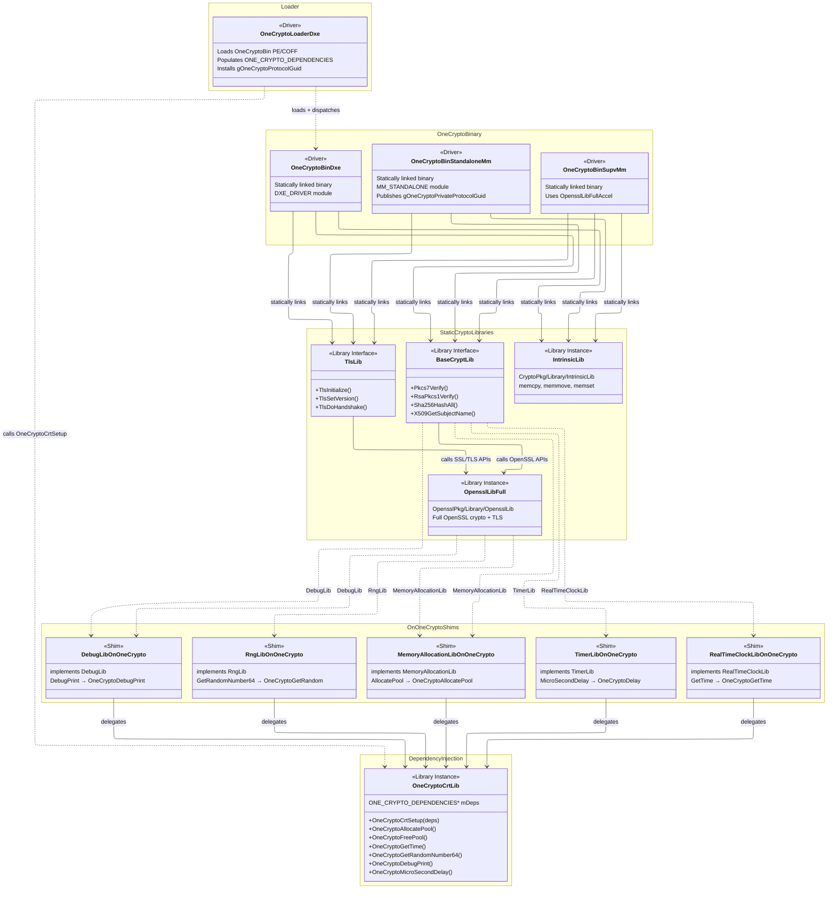

# OneCryptoPkg Architecture

OneCryptoPkg uses a **Bin + Loader** pattern to provide crypto services. A
**Bin** module contains the crypto implementation (BaseCryptLib backed by
OpenSSL) and a **Loader** module discovers the Bin, injects runtime
dependencies, and installs the public `gOneCryptoProtocolGuid` for consumers.

## X64

X64 produces **5 drivers**: 3 from `OneCryptoBin` and 2 from `OneCryptoLoaders`
(plus a shared `OneCryptoLoaderStandaloneMm`).

| Environment     | Bin                        | Loader                        |
|-----------------|----------------------------|-------------------------------|
| DXE             | *(loaded from FV)*         | `OneCryptoLoaderDxe`          |
| StandaloneMm    | `OneCryptoBinStandaloneMm` | `OneCryptoLoaderStandaloneMm` |
| SupvMm          | `OneCryptoBinSupvMm`       | `OneCryptoLoaderSupvMm`       |

### DXE Flow (X64)

On X64 there is no separate DXE Bin driver. The DXE Loader reuses the
`MM_STANDALONE` binary directly:

1. `OneCryptoLoaderDxe` calls `GetSectionFromAnyFv()` to locate the
   `OneCryptoBinStandaloneMm` PE32 image by GUID.
2. Calls `gBS->LoadImage()` so the UEFI loader applies the correct memory
   protections and page mappings.
3. Parses the PE/COFF export directory to resolve the `CryptoEntry` symbol.
4. Calls `CryptoEntry()` with a dependency structure (allocators, debug, RNG)
   and receives the crypto protocol in return.
5. Installs `gOneCryptoProtocolGuid` for other DXE drivers.

### MM Flow (X64)

Both StandaloneMm and SupvMm follow the same two-driver pattern:

1. The Bin module is dispatched by the MM environment. Its entry point installs
   `gOneCryptoPrivateProtocolGuid` with a `CryptoEntry` constructor.
2. The Loader has a `[Depex]` on `gOneCryptoPrivateProtocolGuid`. It locates
   the private protocol, calls the constructor with injected dependencies, and
   installs the public `gOneCryptoProtocolGuid`.

## AARCH64

AARCH64 produces **4 drivers**: 2 from `OneCryptoBin` and 2 from
`OneCryptoLoaders`.

| Environment     | Bin                        | Loader                            |
|-----------------|----------------------------|-----------------------------------|
| DXE             | `OneCryptoBinDxe`          | `OneCryptoLoaderDxeByProtocol`    |
| StandaloneMm    | `OneCryptoBinStandaloneMm` | `OneCryptoLoaderStandaloneMm`     |

> There is no SupvMm on AARCH64 because the MM Supervisor is X64-only.

### DXE Flow (AARCH64)

On AARCH64 the DXE Loader **cannot** reach into the secure-world firmware
volume to load the StandaloneMm binary. Instead, a dedicated `OneCryptoBinDxe`
(`DXE_DRIVER`) is included in the normal-world FV:

1. `OneCryptoBinDxe` is dispatched normally by the UEFI DXE dispatcher. Its
   entry point installs `gOneCryptoPrivateProtocolGuid` with the crypto
   constructor.
2. `OneCryptoLoaderDxeByProtocol` has a `[Depex]` on
   `gOneCryptoPrivateProtocolGuid`. It calls `LocateProtocol()` to find the
   private protocol, invokes the constructor, and installs the public
   `gOneCryptoProtocolGuid`.

This protocol-based approach avoids PE/COFF export parsing entirely.

### MM Flow (AARCH64)

Identical to the X64 MM flow — `OneCryptoBinStandaloneMm` and
`OneCryptoLoaderStandaloneMm` are shared across both architectures.

## Why the Difference?

On AARCH64, StandaloneMm runs inside TrustZone and the secure-world firmware
volume is not accessible from normal-world DXE. On X64, `GetSectionFromAnyFv()`
can reach the MM firmware volume, so the DXE Loader reuses the MM binary
directly. On AARCH64, a separate `OneCryptoBinDxe` must be included in the
normal-world FV.

> **Note:** Some AARCH64 platforms do launch a Supervisor MM environment within
> TrustZone. Adding `OneCryptoBinSupvMm` and `OneCryptoLoaderSupvMm` support
> for AARCH64 is on the roadmap.

## Module Summary

| Module                         | Type            | X64 | AARCH64 |
|--------------------------------|-----------------|:---:|:-------:|
| `OneCryptoBinStandaloneMm`     | `MM_STANDALONE` |  ✓  |    ✓    |
| `OneCryptoBinSupvMm`           | `MM_STANDALONE` |  ✓  |         |
| `OneCryptoBinDxe`              | `DXE_DRIVER`    |     |    ✓    |
| `OneCryptoLoaderStandaloneMm`  | `MM_STANDALONE` |  ✓  |    ✓    |
| `OneCryptoLoaderSupvMm`        | `MM_STANDALONE` |  ✓  |         |
| `OneCryptoLoaderDxe`           | `DXE_DRIVER`    |  ✓  |         |
| `OneCryptoLoaderDxeByProtocol` | `DXE_DRIVER`    |     |    ✓    |

## Dependency Injection

The crypto Bin binary statically links BaseCryptLib, TlsLib, and OpenSSL, but
it cannot hard-link platform services like DebugLib or MemoryAllocationLib
because those vary per platform. Instead, OneCryptoPkg uses **dependency
injection** through `OneCryptoCrtLib` and a set of `*OnOneCrypto` shim
libraries.

Each shim library (e.g. `DebugLibOnOneCrypto`) implements a standard UEFI
library interface but delegates every call to `OneCryptoCrtLib`, which holds a
pointer to a `ONE_CRYPTO_DEPENDENCIES` structure. At load time, the Loader
populates this structure with the platform's real implementations and calls
`OneCryptoCrtSetup()` before invoking `CryptoEntry`.

