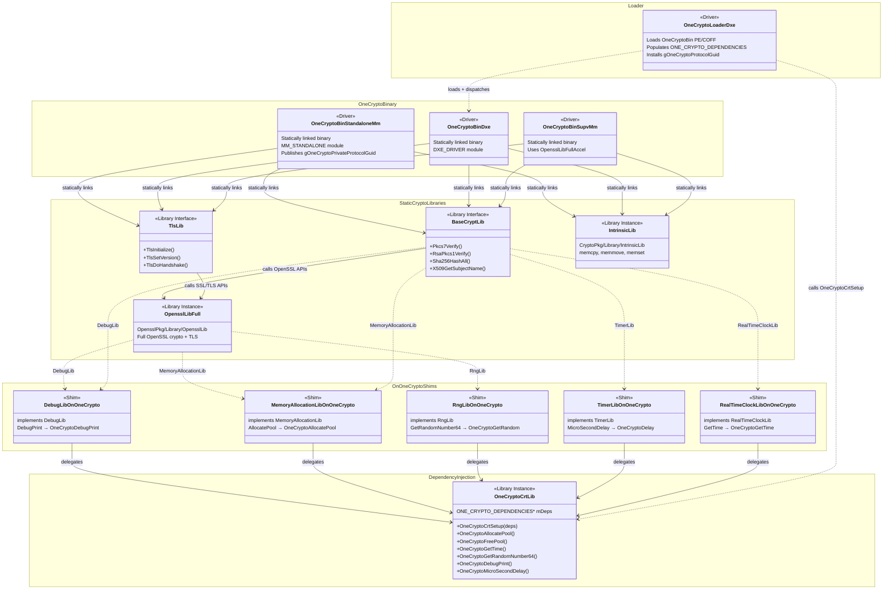

# OneCryptoPkg Architecture

OneCryptoPkg uses a **Bin + Loader** pattern to provide crypto services. A
**Bin** module contains the crypto implementation (BaseCryptLib backed by
OpenSSL) and a **Loader** module discovers the Bin, injects runtime
dependencies, and installs the public `gOneCryptoProtocolGuid` for consumers.

X64 supports a single stored MM binary consumed by DXE.

AARCH64 supports two mechanisms:

- single-copy (preferred mechanism)
  - MM-provider based shared copy
- dual-copy
  - each phase carries its own binary

See [Why the Difference?](#why-the-difference) for details.

## X64

X64 defines **5 drivers** total, but a given platform only uses **3** of them.
A platform selects either the StandaloneMm or SupvMm environment — never both —
and the DXE Loader reuses whichever MM binary the platform chose.

| MM Flavor    | Bin (MM + DXE)             | MM Loader                     | DXE Loader          |
|--------------|----------------------------|-------------------------------|---------------------|
| StandaloneMm | `OneCryptoBinStandaloneMm` | `OneCryptoLoaderStandaloneMm` | `OneCryptoLoaderDxe`|
| SupvMm       | `OneCryptoBinSupvMm`       | `OneCryptoLoaderSupvMm`       | `OneCryptoLoaderDxe`|

Both `OneCryptoBinStandaloneMm` and `OneCryptoBinSupvMm` share the same
`FILE_GUID` (`ONE_CRYPTO_BINARY_GUID`), so `OneCryptoLoaderDxe` is agnostic —
it locates whichever one is present in the firmware volume.

### DXE Flow (X64)

On X64 there is no separate DXE Bin driver. The DXE Loader reuses the
platform's `MM_STANDALONE` binary directly:

1. `OneCryptoLoaderDxe` calls `GetSectionFromAnyFv()` with
   `ONE_CRYPTO_BINARY_GUID` to locate the MM Bin PE32 image (either
   `OneCryptoBinStandaloneMm` or `OneCryptoBinSupvMm`, whichever the platform
   included).
2. Calls `gBS->LoadImage()` so the UEFI loader applies the correct memory
   protections and page mappings.
3. Parses the PE/COFF export directory to resolve the `CryptoEntry` symbol.
4. Calls `CryptoEntry()` with a dependency structure (allocators, debug, RNG)
   and receives the crypto protocol in return.
5. Installs `gOneCryptoProtocolGuid` for other DXE drivers.

### MM Flow (X64)

Both StandaloneMm and SupvMm follow the same two-driver pattern:

1. The Bin module is dispatched by the MM environment. Its entry point installs
   `gOneCryptoPrivateProtocolGuid` with a `CryptoEntry` constructor.
2. The Loader has a `[Depex]` on `gOneCryptoPrivateProtocolGuid`. It locates
   the private protocol, calls the constructor with injected dependencies, and
   installs the public `gOneCryptoProtocolGuid`.

## AARCH64

AARCH64 supports two modes:

- **Single-copy** (preferred): the secure-world MM Bin is the only stored
  OneCrypto image; DXE fetches its bytes from MM and `LoadImage()`s them.
  - DXE: `OneCryptoLoaderDxeFromMm`
  - StandaloneMm: `OneCryptoImageProviderStandaloneMm` +
    `OneCryptoBinStandaloneMm` + `OneCryptoLoaderStandaloneMm`
- **Dual-copy**: dedicated normal-world and secure-world Bin and loader.
  - DXE: `OneCryptoBinDxe` + `OneCryptoLoaderDxeByProtocol`
  - StandaloneMm: `OneCryptoBinStandaloneMm` + `OneCryptoLoaderStandaloneMm`

### DXE Flow (AARCH64)

#### Single-copy mode

With no DXE Bin, `OneCryptoLoaderDxeFromMm` pulls the image from the MM provider
over `EFI_MM_COMMUNICATION2_PROTOCOL`:

1. Loader queries total image size and **serve format** via
   `gOneCryptoImageProviderGuid`.
2. Loader fetches the bytes in chunks sized to the MM communication buffer.
3. Loader consumes the bytes according to the format (below), resolves
   `CryptoEntry`, injects dependencies, and installs `gOneCryptoProtocolGuid`.

##### Two serve formats (boot paths)

The provider is format-agnostic and keys on one invariant: OneCryptoBin's
`FILE_GUID` (`ONE_CRYPTO_BINARY_GUID`). How the platform *packages* that file
selects which path runs — no provider change is needed.

| Format                            | Provider serves               | DXE work                                        | When to use                             |
| --------------------------------- | ----------------------------- | ----------------------------------------------- | --------------------------------------- |
| `ONE_CRYPTO_IMAGE_FORMAT_PE32`    | pristine PE32 bytes           | `LoadImage()` directly                          | discoverable, uncompressed FV           |
| `ONE_CRYPTO_IMAGE_FORMAT_GUIDED_FV` | raw compressed `GUID_DEFINED` bytes | decode, walk FV, extract by GUID, `LoadImage()` | flash constrained; OneCrypto compressed |

The compressed path exists because secure-world MMRAM may not have room to
decompress the image, so the provider passes the compressed binary to DXE,
which has ample heap to expand it.

#### Dual-copy mode

This mode ships a dedicated `OneCryptoBinDxe` (`DXE_DRIVER`) in the normal-world
FV:

1. `OneCryptoBinDxe` is dispatched by DXE and installs
    `gOneCryptoPrivateProtocolGuid`.
2. `OneCryptoLoaderDxeByProtocol` has a `[Depex]` on
    `gOneCryptoPrivateProtocolGuid`, calls `LocateProtocol()`, invokes the
    constructor, and installs `gOneCryptoProtocolGuid`.

This protocol-based approach avoids PE/COFF export parsing.

### MM Flow (AARCH64)

`OneCryptoBinStandaloneMm` + `OneCryptoLoaderStandaloneMm` follow the same MM
Bin+Loader pattern as X64.

In single-copy mode, `OneCryptoImageProviderStandaloneMm` is a separate MM module
that owns the DXE transport path described above. Splitting it from
`OneCryptoLoaderStandaloneMm` keeps MM-communication failures isolated from the
protocol-construction logic.

## Packaging the Single-Copy Image (FDF / DSC)

Packaging trades flash size against a DXE-side decode, and discovery is
**strict**: the provider scans the FVs published to MM as FV/FV2/FV3 HOBs
(FV3 first) and matches a well-known `FILE_GUID`. It takes either OneCryptoBin's
PE32 directly (`ONE_CRYPTO_BINARY_GUID`, Mode A) or a container file
(`ONE_CRYPTO_CONTAINER_FV_GUID`) whose `GUID_DEFINED` section wraps the nested FV
(Mode B). It does **not** scan generic compressed nested FVs. Both GUIDs are
defined in `OneCryptoPkg/Include/Guid/OneCryptoFileGuid.h`.

### Two packaging modes

| Mode                            | FDF packaging                                     | Flash   | DXE decode |
| ------------------------------- | ------------------------------------------------- | ------- | ---------- |
| **A - Direct PE32**             | top-level file in a discoverable FV, uncompressed | largest | none       |
| **B - Dedicated compressed FV** | its own identity-tagged, LZMA-wrapped FV          | small   | in DXE     |

Mode A and B map to the `PE32` and `GUIDED_FV`
[serve formats](#two-serve-formats-boot-paths) the provider reports at runtime.

Mode A is simplest and most robust; Mode B trades a DXE-side LZMA decode for a
smaller flash footprint on space-constrained parts.

### FDF (Mode B example)

Give OneCryptoBin its own compressed FV anchored by a well-known container GUID,
and keep the DXE loader + MM provider/loader in their normal FVs:

```text
[FV.OneCryptoFv]                       # dedicated, compressed
  INF .../OneCryptoBin/OneCryptoBinStandaloneMm.inf

[FV.<SecureMmPayload>]                 # secure-world MM FV
  INF .../OneCryptoLoaders/OneCryptoLoaderStandaloneMm.inf
  INF .../OneCryptoLoaders/OneCryptoImageProviderStandaloneMm.inf
  # anchor the dedicated FV so the provider finds it by identity:
  FILE FV_IMAGE = <ONE_CRYPTO_CONTAINER_FV_GUID> {
    SECTION GUIDED <LZMA_GUID> PROCESSING_REQUIRED = TRUE {
      SECTION FV_IMAGE = OneCryptoFv
    }
  }

[FV.<DxeFv>]                           # normal-world DXE FV
  INF .../OneCryptoLoaders/OneCryptoLoaderDxeFromMm.inf
```

### DSC

Disable shared-crypto for the DXE/MM phases and route `BaseCryptLib` through the
OneCrypto protocol, so the variable/TPM/secure-boot MM consumers depend on
`gOneCryptoProtocolGuid` (published by OneCryptoBin in MM) rather than a
shared-crypto SMM protocol that no longer exists:

```text
[LibraryClasses.common.DXE_DRIVER]
  BaseCryptLib|.../BaseCryptLibOnOneCrypto/DxeCryptLib.inf

[LibraryClasses.common.MM_STANDALONE]
  BaseCryptLib|.../BaseCryptLibOnOneCrypto/StandaloneMmCryptLib.inf
```

Every INF referenced by the FDF must also appear in `[Components]`; list the DXE
loader, MM loader, MM provider, and MM Bin there.

### Heap budget expectations

The bytes that matter are **StandaloneMmCore heap** (secure-world MMRAM), not
the flash FV size. Rough per-component costs during MM bring-up:

| Component                        | Secure-world heap cost                        | Notes                  |
| -------------------------------- | --------------------------------------------- | ---------------------- |
| `OneCryptoBinStandaloneMm`       | ~1.5 MB, ~doubled while resident (FV + image) | full crypto + TLS      |
| MM communication bounce buffer   | up to the comm-buffer size (e.g. ~1 MB)       | transient, per request |
| MM loader / provider             | small (tens of KB)                            | --                     |

Treat these as per-component estimates to sum against the platform's own MMRAM
carve-out, not a fixed budget. The **~2 MB** Mode B LZMA decode is not included;
it runs in DXE.

## Why the Difference?

On X64, `GetSectionFromAnyFv()` can reach the MM firmware volume, so the DXE
Loader reuses the MM binary directly. On AARCH64, StandaloneMm runs inside
TrustZone and its firmware volume is not accessible from normal-world DXE, which
is why AARCH64 needs the two modes above rather than X64's direct reuse.

## Module Summary

| Module                         | Type            | X64 | AARCH64 |
|--------------------------------|-----------------|:---:|:-------:|
| `OneCryptoBinStandaloneMm`     | `MM_STANDALONE` |  ✓  |    ✓    |
| `OneCryptoBinSupvMm`           | `MM_STANDALONE` |  ✓  |         |
| `OneCryptoBinDxe`              | `DXE_DRIVER`    |     |    ✓    |
| `OneCryptoLoaderStandaloneMm`  | `MM_STANDALONE` |  ✓  |    ✓    |
| `OneCryptoLoaderSupvMm`        | `MM_STANDALONE` |  ✓  |         |
| `OneCryptoLoaderDxe`           | `DXE_DRIVER`    |  ✓  |         |
| `OneCryptoLoaderDxeByProtocol` | `DXE_DRIVER`    |     |    ✓    |

Single-copy mode modules on AARCH64:

- `OneCryptoLoaderDxeFromMm` (`DXE_DRIVER`)
- `OneCryptoImageProviderStandaloneMm` (`MM_STANDALONE`)

## Dependency Injection

The crypto Bin binary statically links BaseCryptLib, TlsLib, and OpenSSL, but
it cannot hard-link platform services like DebugLib or MemoryAllocationLib
because those vary per platform. Instead, OneCryptoPkg uses **dependency
injection** through `OneCryptoCrtLib` and a set of `*OnOneCrypto` shim
libraries.

Each shim library (e.g. `DebugLibOnOneCrypto`) implements a standard UEFI
library interface but delegates every call to `OneCryptoCrtLib`, which holds a
pointer to a `ONE_CRYPTO_DEPENDENCIES` structure. At load time, the Loader
populates this structure with the platform's real implementations and calls
`OneCryptoCrtSetup()` before invoking `CryptoEntry`.


```mermaid
classDiagram
    direction TB

    namespace StaticCryptoLibraries {
        class BaseCryptLib {
            <<Library Interface>>
            +Pkcs7Verify()
            +RsaPkcs1Verify()
            +Sha256HashAll()
            +X509GetSubjectName()
        }
        class TlsLib {
            <<Library Interface>>
            +TlsInitialize()
            +TlsSetVersion()
            +TlsDoHandshake()
        }
        class OpensslLibFull {
            <<Library Instance>>
            OpensslPkg/Library/OpensslLib
            Full OpenSSL crypto + TLS
        }
        class IntrinsicLib {
            <<Library Instance>>
            CryptoPkg/Library/IntrinsicLib
            memcpy, memmove, memset
        }
    }

    namespace OnOneCryptoShims {
        class DebugLibOnOneCrypto {
            <<Shim>>
            implements DebugLib
            DebugPrint → OneCryptoDebugPrint
        }
        class MemoryAllocationLibOnOneCrypto {
            <<Shim>>
            implements MemoryAllocationLib
            AllocatePool → OneCryptoAllocatePool
        }
        class RngLibOnOneCrypto {
            <<Shim>>
            implements RngLib
            GetRandomNumber64 → OneCryptoGetRandom
        }
        class TimerLibOnOneCrypto {
            <<Shim>>
            implements TimerLib
            MicroSecondDelay → OneCryptoDelay
        }
        class RealTimeClockLibOnOneCrypto {
            <<Shim>>
            implements RealTimeClockLib
            GetTime → OneCryptoGetTime
        }
    }

    namespace DependencyInjection {
        class OneCryptoCrtLib {
            <<Library Instance>>
            ONE_CRYPTO_DEPENDENCIES* mDeps
            +OneCryptoCrtSetup(deps)
            +OneCryptoAllocatePool()
            +OneCryptoFreePool()
            +OneCryptoGetTime()
            +OneCryptoGetRandomNumber64()
            +OneCryptoDebugPrint()
            +OneCryptoMicroSecondDelay()
        }
    }

    namespace OneCryptoBinary {
        class OneCryptoBinStandaloneMm {
            <<Driver>>
            Statically linked binary
            MM_STANDALONE module
            Publishes gOneCryptoPrivateProtocolGuid
        }
        class OneCryptoBinSupvMm {
            <<Driver>>
            Statically linked binary
            Uses OpensslLibFullAccel
        }
        class OneCryptoBinDxe {
            <<Driver>>
            Statically linked binary
            DXE_DRIVER module
        }
    }

    namespace Loader {
        class OneCryptoLoaderDxe {
            <<Driver>>
            Loads OneCryptoBin PE/COFF
            Populates ONE_CRYPTO_DEPENDENCIES
            Installs gOneCryptoProtocolGuid
        }
    }

    %% Static linking into OneCryptoBin
    OneCryptoBinStandaloneMm --> BaseCryptLib : statically links
    OneCryptoBinStandaloneMm --> TlsLib : statically links
    OneCryptoBinStandaloneMm --> IntrinsicLib : statically links
    OneCryptoBinDxe --> BaseCryptLib : statically links
    OneCryptoBinDxe --> TlsLib : statically links
    OneCryptoBinDxe --> IntrinsicLib : statically links
    OneCryptoBinSupvMm --> BaseCryptLib : statically links
    OneCryptoBinSupvMm --> TlsLib : statically links
    OneCryptoBinSupvMm --> IntrinsicLib : statically links

    %% BaseCryptLib depends on OpensslLib
    BaseCryptLib --> OpensslLibFull : calls OpenSSL APIs
    TlsLib --> OpensslLibFull : calls SSL/TLS APIs

    %% OpensslLib platform dependencies satisfied by shims
    OpensslLibFull ..> DebugLibOnOneCrypto : DebugLib
    OpensslLibFull ..> MemoryAllocationLibOnOneCrypto : MemoryAllocationLib
    OpensslLibFull ..> RngLibOnOneCrypto : RngLib
    BaseCryptLib ..> TimerLibOnOneCrypto : TimerLib
    BaseCryptLib ..> RealTimeClockLibOnOneCrypto : RealTimeClockLib
    BaseCryptLib ..> MemoryAllocationLibOnOneCrypto : MemoryAllocationLib
    BaseCryptLib ..> DebugLibOnOneCrypto : DebugLib

    %% All shims delegate to OneCryptoCrtLib
    DebugLibOnOneCrypto --> OneCryptoCrtLib : delegates
    MemoryAllocationLibOnOneCrypto --> OneCryptoCrtLib : delegates
    RngLibOnOneCrypto --> OneCryptoCrtLib : delegates
    TimerLibOnOneCrypto --> OneCryptoCrtLib : delegates
    RealTimeClockLibOnOneCrypto --> OneCryptoCrtLib : delegates

    %% Loader populates dependencies
    OneCryptoLoaderDxe ..> OneCryptoCrtLib : calls OneCryptoCrtSetup
    OneCryptoLoaderDxe ..> OneCryptoBinDxe : loads + dispatches

```
